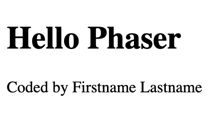

# A-2 Add HTML for Game

Let's add the starter HTML needed for a Phaser game.


**HOW TO COPY CODE:**  In this guidebook, you can click the **copy icon** displayed in the upper right of a code block to copy all the code to the clipboard for pasting.


## Add Starter HTML

Copy this HTML, and paste it into your `index.html` file \(replacing any other starter HTML that might already be present\):

```markup
<!DOCTYPE html>
<html>
  <head>
    <meta charset="utf-8">
    <meta name="viewport" content="width=device-width">
    <title>My Game</title>
    <link href="style.css" rel="stylesheet" type="text/css">
  </head>
  <body>
	<div id="my-game"></div>
	<script src="https://cdnjs.cloudflare.com/ajax/libs/phaser-ce/2.13.2/phaser.min.js"></script>
	<script src="script.js"></script>
  </body>
</html>
```

This is the basic HTML required for a Phaser CE game. All of your games will start with this HTML \(though you can also insert additional HTML to customize the game's webpage\).

Here is an explanation of the key things this HTML does: 

* **STYLESHEET:**  The `<link>` tag on line 7 loads your CSS stylesheet file named `style.css`, which can be used to style the webpage your game is embedded within.
* **GAME CANVAS CONTAINER:**  The `<div>` element on line 10 will contain your game canvas, which will literally be a `<canvas>` element that will be inserted by your Phaser game code. This `<div>` element has been given an id name of `my-game`, so your Phaser game code can identify where to insert the canvas for your game.
* **PHASER CE FRAMEWORK:**  The `<script>` tag on line 11 loads the Phaser CE game framework JS file named `phaser.min.js`. In this case, the file is being loaded remotely from a CDN \(Content Delivery Network\) using a URL. However, if necessary, this `<script>` tag can be modified to load a local copy of the Phaser CE JS file.
* **YOUR GAME CODE:**  The `<script>` tag on line 12 loads your JS file named `script.js`, which will contain your Phaser game code. You can use a different name for this file \(such as: `code.js` or `game.js`\) as long as the `<script>` tag matches the filename of your game code.


**IMPORTANT:**  Be sure the `<script>` tag that loads the Phaser CE game framework \(`phaser.min.js`\) is listed **before** the `<script>` tag that loads your game code \(`script.js`\). If their order is reversed, your game won't work.


## Add Game Title and Your Name

Let's add some more HTML to display the game's title and your name on the webpage containing your game.

Modify the `<title>` element on line 6 to list `Hello Phaser` as the webpage title. This title is displayed at the top of the browser window \(or tab\) — but **not** on the webpage itself. This would be used as the webpage's title if it were bookmarked in your browser or listed on a search engine's results page.

On your game's webpage, you'll use a heading \(`<h1>`\) to display the game title and a paragraph \(`<p>`\) to display your name. Let's display this information below your game. Remember that the `<div>` element on line 10 will eventually contain your game canvas, so you'll want to add this new HTML **after** the `<div>` element.

Create a blank line \(using the return key\) between line 10 \(`<div>` element\) and line 11 \(first `<script>` tag\). Then copy this HTML, and paste it into the blank line:

```markup
  <h1>Hello Phaser</h1>
  <p>Coded by Firstname Lastname</p>
```

Now modify the text within the `<p>` element to list your actual first and last names.


**HTML:**  If you want to learn more about HTML or need a quick reference, check out the [W3Schools HTML Tutorial and Reference](https://www.w3schools.com/html/default.asp).


## Preview Webpage

Preview the webpage in your code editor. Depending on your code editor, you might need to refresh its preview pane.

At this point, your webpage will look very plain \(because there's no CSS listed yet in the `style.css` file\) — and it won't have a game canvas yet \(because there's no JS listed yet in the `script.js` file\).

You'll simply see the game title \(`<h1>` element\) and your name \(`<p>` element\) listed in the browser's default serif font with the text left-aligned and displayed at the top of the webpage. There won't be any visible game canvas yet.




