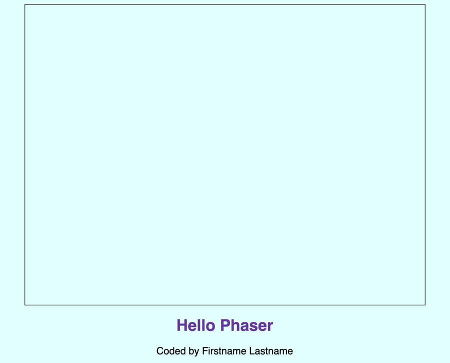

# A-3 Add CSS for Game

Next, let's add some CSS to style the appearance of your game's webpage.

## Add CSS for Game Container

A Phaser CE game does **not** require any special CSS in order for the game to work.

However, you'll add some optional CSS to style the `<div>` element that will contain your game canvas. Remember that this `<div>` element was given an id name of `my-game` which can be used to select this element with your CSS.

Copy this CSS, and paste it into your `style.css` file \(replacing any other starter CSS that might already be present\):

```css
#my-game {
  /* optional CSS for game container */
  width: 800px;
  height: 600px;
  margin: 0 auto;
  border: 1px solid black;
}
```

Here is an explanation of what this CSS does:

* Lines 3 and 4 set the width and height \(in pixels\) for the `<div>` element that will contain the game canvas.  Later in your JS game code, you'll set your game canvas to these same exact dimensions.
* Line 5 sets the margins around the `<div>` element. The top and bottom margins are set to zero. The left and right margins are set to `auto`, which will center the game canvas horizontally on the webpage.
* Line 6 displays a border around the `<div>` element.

## Add CSS for Other Elements

Let's add some other optional CSS to style some of the other elements of the webpage.

Copy this CSS, and paste it into your `style.css` file after your existing CSS:

```css
/* optional CSS for webpage */

body {
  background-color: #E0FFFF;
  font-family: sans-serif;
  text-align: center;
}

h1 {
  color: #663399;
}

p {
  font-size: 1.25em;
}
```

As you can see, this CSS styles some of the properties for several elements on the webpage:

* The `<body>` element is given a light blue background color and is set to use a sans-serif font for all text, which will also be center-aligned on the webpage.
* The `<h1>` element is set to use a purple text color \(instead of the default color of black\).
* The `<p>` element is set to use a larger font size \(instead of the default size of 1em\).

Again, all of this CSS is optional. If you wanted, you could modify this CSS — or add other CSS to style additional properties for the elements on the webpage.


**CSS:**  If you want to learn more about CSS or need a quick reference, check out the [W3Schools CSS Tutorial and Reference](https://www.w3schools.com/css/default.asp).


## Preview Webpage

Preview the webpage in your code editor. Depending on your code editor, you might need to refresh its preview pane. If necessary, open the preview in a new tab or window to see it fullscreen.

Your webpage should have a light blue background, and you should see a black border outlining where the game canvas will eventually be inserted. Below that you should see the game's title \(in purple text\) and your name. Everything should be centered horizontally.



