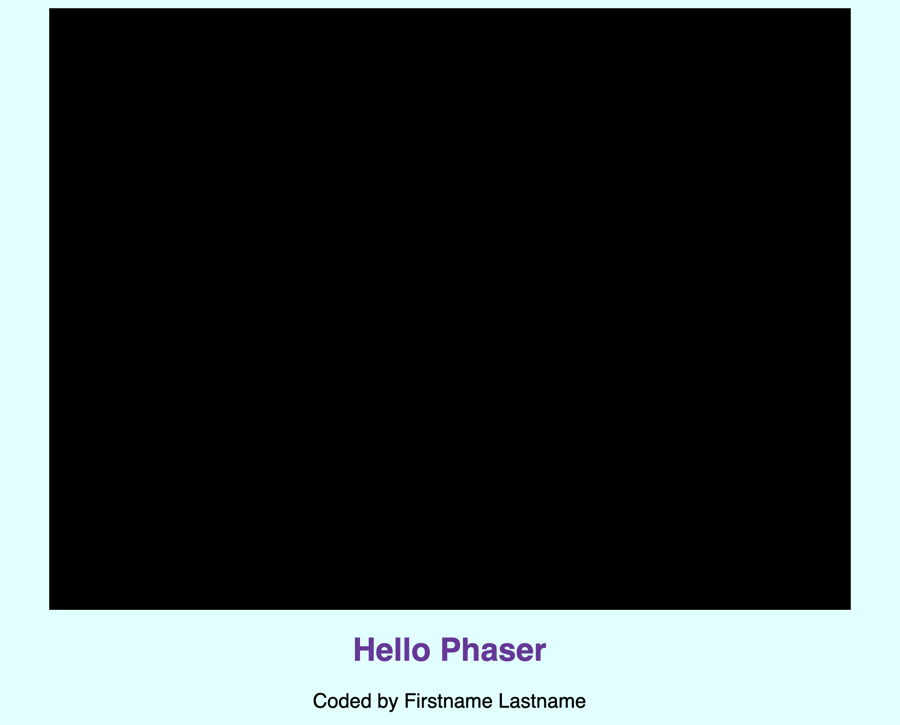

# A-4 Add JS for Game

Next, let's add the starter JS code needed for a Phaser CE game.

## Add Starter JS

Copy this JS, and paste it into your `script.js` file \(replacing any other starter JS that might already be present\):

```javascript
// create Phaser.Game object and assign to global variable named game
var game = new Phaser.Game(800, 600, Phaser.AUTO, 'my-game', { preload: preload, create: create, update: update });

// declare other global variables (for sprites, etc.)


// preload game assets - runs one time when webpage first loads
function preload() {

}

// create game world - runs one time after preload finishes
function create() {

}

// update game - runs in continuous loop after create finishes
function update() {

}

// add custom functions (for collisions, etc.) - only run when called

```

This is the core JS required in all Phaser CE games. Your game code will always start with this JS \(though you will need to add more code to actually complete your game\).

There are comments embedded in the JS to help explain the code. Here's a more detailed explanation of what this JS does:

* **PHASER GAME OBJECT:**  Line 2 creates a `Phaser.Game` object \(using a class defined in the `phaser.min.js` file\) and assigns it to a global variable named `game`. This also sets the width and height \(in pixels\) for the game canvas. In this case, the game will be 800 pixels wide and 600 pixels tall. This also specifies the id name of the `<div>` container where the game canvas will be inserted. In this case, the id name used in your HTML is `my-game`. \(If you were to change the width or height of your game canvas, just be sure to also adjust the size of `my-game` in your CSS, so they match.\)
* **GLOBAL VARIABLES:**  Line 5 is an empty placeholder where you will eventually add code to declare other global variables needed for your game. For example, you might need to declare a global variable to store the player's score.  You'll also need to declare global variables for images, sprites, sound effects, player input controls, etc. 
* **PRELOAD FUNCTION:**  Line 8 defines a function named `preload()` that will run one time when the webpage first loads \(or is refreshed\). At the moment, there are no code statements inside the `preload()` function. However, you will eventually add Phaser code to load your game assets into memory \(such as: images, sprites, sounds, etc.\).
* **CREATE FUNCTION:**  Line 13 defines a function named `create()` that will run one time **after** the `preload()` function has finished running. At the moment, there are no code statements inside the `create()` function. However, you will eventually add Phaser code to create your game world by adding images, sprites, input controls, etc.
* **UPDATE FUNCTION:**  Line 18 defines a function named `update()` that will run in a continuous loop **after** the `create()` function has finished running. At the moment, there are no code statements inside the `update()` function. However, you will eventually add Phaser code to update your game by checking for player input, checking for collisions between sprites, etc. 
* **CUSTOM FUNCTIONS:**  Line 23 is an empty placeholder where you will eventually add code to define your own custom functions needed for your game. For example, you might need to define a custom function to perform certain actions when the player's sprite collides with an enemy sprite. These custom functions will only run if and when they're specifically called within other functions \(such as the `update()` function, etc.\).

## Preview Webpage

Preview the webpage in your code editor. Depending on your code editor, you might need to refresh its preview pane. If necessary, open the preview in a new tab or window to see it fullscreen.

Your webpage should now display a solid black game canvas. If not, either the Phaser CE game framework failed to load, or you have a mistake in your code somewhere.



