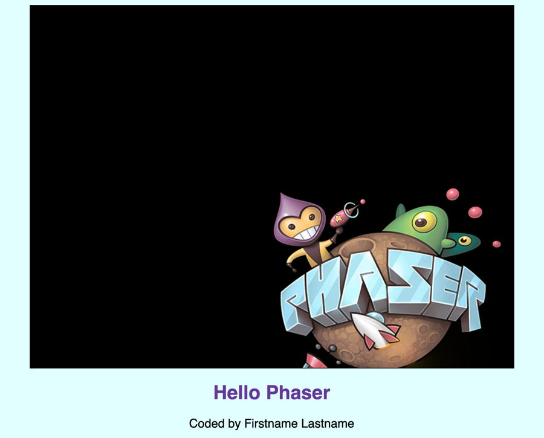
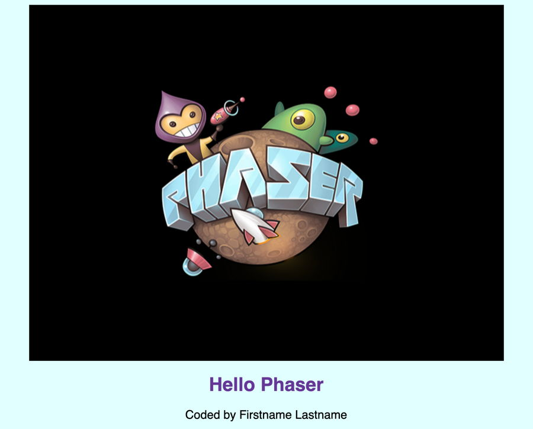

# A-5 Add Image to Game

Next, let's add an image to the game. We'll use the Phaser logo as the image.

## Add Image File to Assets Folder

[Download this image file](https://drive.google.com/open?id=13Q1uDSz5up02Gnk391I09S7-xRLgjxU8) named `phaser.png` to your computer.

Next, add \(or upload\) the image file into the `assets` folder in your code editor.

## Declare Variable for Image

In order to use this image in your game, you'll first need to declare a global variable in your JS game code to represent the image.

In a Phaser CE game, you'll typically have to declare variables for each image, sprite, sound effect, input control, etc. In addition, your game might need variables to track things like the player's score, the time remaining in the game, etc.

Copy this JS code, and paste it into your `script.js` file on line 5 \(which should be blank\):

```javascript
var logo;
```

This JS code statement declares \(creates\) a new global variable named `logo`, which will be used to represent the Phaser logo image.

When coding in JavaScript, you get to decide your own names for your variables — but here are a few rules and recommendations to follow:

* **RULE:**  Each global variable needs to have a **unique** name.
* **RULE:**  Variable names **cannot** be a [reserved keyword in the coding language](https://www.w3schools.com/js/js_reserved.asp).
* **RULE:**  A variable name should start with a letter and **cannot** contain spaces. The name can include letters, digits, underscores, and dollar signs.
* **RULE:**  Variable names are **case-sensitive** \(e.g., `logo` and `LOGO` are different names\).
* **RECOMMENDATION:**  Use **camelCase** for variable names, which means use all lowercase letters, and only use an uppercase letter if you to start a new word in the name \(but don't include spaces between words\). For example:  `enemyShip`
* **RECOMMENDATION:** Variable names should be **clear and concise**, so they'll make sense to anyone reviewing your code.

## Load Image into Memory

The next step is to load the image into the game's memory cache, which is required before you can display the image.

To do this, you'll start using Phaser CE code in your JS file. Remember that your HTML loaded the Phaser CE game framework \(`phaser.min.js`\), which defines classes for objects you can use in your game code. Each Phaser game object has a set of properties \(variables\) and methods \(functions\) that you can use to modify the object.


**PHASER CE REFERENCE:**  The [Phaser CE API reference](https://photonstorm.github.io/phaser-ce/index.html) describes all of the properties and methods for each class of Phaser game objects.


Phaser CE games use the `preload()` function to load all game assets \(images, sprites, sound effects, etc.\) into a memory cache at the start of the game. This helps prevent delays or errors during gameplay.

Copy this Phaser CE code statement, and insert it within the `preload()` function by pasting it on line 9 \(which should be blank\):

```javascript
  game.load.image('phaser-logo', 'assets/phaser.png');
```

Let's explain how this Phaser code statement works:

* Notice that the first part of the code statement starts with `game`, which is the name of the global variable representing your `Phaser.Game` object \(i.e., your entire game\).
* Within your `game` object, there is another object called `load` that is used to load game assets. The `load` object is one of many objects within your `game` that were created automatically by `phaser.min.js` when you created your `game` object.
* The `load` object has a method \(i.e., function\) called `image()` that is specifically used to load an image asset file into your game's cache memory.

Note that two parameters are listed inside the parentheses of the `game.load.image()` method \(in this order\):

* **Asset Key** — which is a unique name that will represent the asset file, sort of like a variable name. In this case, `'phaser-logo'` is the asset key. Each asset key should be a unique text string listed within quotes. You'll use this asset key to refer to this specific asset file in other Phaser code statements \(e.g., when you add the image to your game\). 
* **Asset URL** — which is the web address \(including folder path and filename\) to locate the asset file. In this case, `'assets/phaser.png'` is the URL for the a specific image file stored within your `assets` folder. The URL should be listed within quotes.

## Add Image to Game

The next step is to add the image to the game world, which will display the image on the canvas.

Phaser CE games use the `create()` function to create your game world by adding images, sprites, sound effects, input controls, etc.

Copy this Phaser CE code statement, and insert it within the `create()` function by pasting it on line 14 \(which should be blank\):

```javascript
  logo = game.add.image(400, 300, 'phaser-logo');
```

This code statement actually does two things:

1. It adds an image to the game using the asset key named `'phaser-logo'`.
2. It assigns that image to your global variable named `logo`.

If necessary, you can simply add an image to your game **without** assigning the image to a global variable. However, you **won't** be able to change any of the image's properties later.

By assigning the image to a variable when the image is first added, you'll gain the ability to change the image's properties later in your game code.

Note that three parameters are listed inside the parentheses of the `game.add.image()` method \(in this order\):

* **X-Coordinate** — which will be the horizontal position \(in pixels\) of the image within the game world. In this case, `400` will be the x-coordinate. This is the horizontal center of your game, since you set your canvas to 800 pixels wide on line 2 of your game code.
* **Y-Coordinate** — which will be the vertical position \(in pixels\) of the image within the game world. In this case, `300` will be the y-coordinate. This is the vertical center of your game, since you set your canvas to 600 pixels tall on line 2 of your game code.
* **Asset Key** — which represents an asset file previously loaded into the game memory. In this case, `'phaser-logo'` is the asset key.

Here's an summary of the x-y coordinate system in a Phaser game:

* The x-coordinate increases from left to right. By default, the left edge of your game world represents the `0` position for the x-coordinate.
* The y-coordinate increases from top to bottom. By default, the top edge of your game world represents the `0` position for the y-coordinate.


**GAME WORLD VS. GAME CANVAS:**  By default, the game world is set to the same size as the game canvas. However, you can make your game world larger than your game canvas \(and make the game canvas scroll automatically as the player moves through the game world\).


## Preview Game

Preview the game in your code editor. Depending on your code editor, you might need to refresh its preview pane. If necessary, open the preview in a new tab or window to view it in fullscreen.

Your game should display the Phaser logo image on the game canvas. Even though the image was added to the center position of the game, the image will **not** appear to be visually centered. Instead, the image will appear in the lower-right quadrant of the game canvas. We'll fix this by adding some more Phaser code.



## Set Anchor for Image

Next, you'll change one of the image's properties, in order to visually center the image on your game canvas.

Phaser game objects that are displayed \(such as images, sprites, text, etc.\) have a property called **anchor**, which is used as the reference point for positioning the object in the game world. By default, an object's anchor point is set to its top-left corner.

So if you look at your Phaser logo image again, you'll see that its top-left corner is actually located in the center of the game canvas. However, what we really want is to have the logo image visually centered on the canvas.

Let's change the anchor point for the Phaser logo image to its center, instead of its top-left corner. We **won't** change the position of the image, which will still be `(400, 300)`. We'll simply change the anchor point used to determine how it is positioned.

Copy this Phaser CE code statement, and insert it within the `create()` function by pasting it on a new line immediately **after** line 14 \(which added the image\):

```javascript
  logo.anchor.setTo(0.5, 0.5);
```

Let's explain how this Phaser code statement works:

* Notice that the first part of the code statement starts with `logo`, which is the name of the global variable representing your image.
* Within your image, there is a property called `anchor` that is used to position the image. The `anchor` property is one of many properties within your `logo` image that were created automatically by `phaser.min.js` when you added the image.
* The `anchor` property can be modified using a method called `setTo()`.

Note that two parameters are listed inside the parentheses of the `logo.anchor.setTo()` method \(in this order\):

* **Horizontal Anchor** — which is a decimal value between 0-1, representing the horizontal anchor position \(0 = left edge, 1 = right edge\). In this case, `0.5` represents the image's horizontal center. 
* **Vertical Anchor** — which is a decimal value between 0-1, representing the vertical anchor position \(0 = top edge, 1 = bottom edge\). In this case, `0.5` represents the image's vertical center.

Again, the default anchor point used to position objects in the game world is the object's top-left corner `(0,0)`. However, you'll find that it will make more sense to position certain objects with the object's anchor point set to the object's center `(0.5, 0.5)`.

## Preview Game Again

Preview the game in your code editor. Depending on your code editor, you might need to refresh its preview pane. If necessary, open the preview in a new tab or window to view it in fullscreen.

Your game should display the Phaser logo image visually centered on the game canvas.



